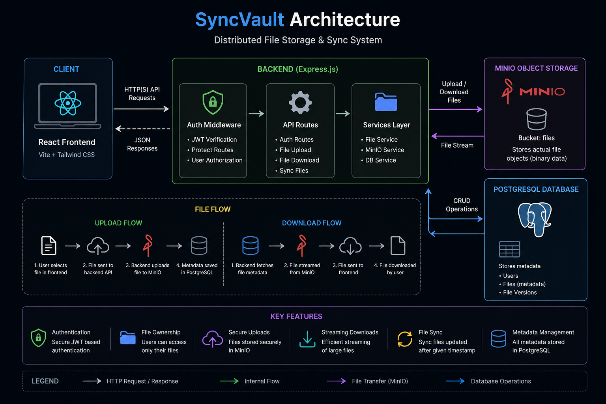

# SyncVault

A full-stack distributed file storage and sync platform built using React, Node.js, PostgreSQL, and MinIO.

SyncVault allows users to securely upload, store, sync, and download files with JWT-based authentication and user-specific access control.

---

## Features

- JWT Authentication
- Protected Routes & APIs
- Secure File Uploads
- File Downloads with Streaming
- User-Specific File Ownership
- Object Storage using MinIO
- PostgreSQL Metadata Management
- Full React Frontend
- Responsive Dark UI
- Multipart File Handling
- Persistent Login using JWT

---

## Tech Stack

### Frontend

- React
- Vite
- Tailwind CSS
- Axios
- React Router DOM

### Backend

- Node.js
- Express.js
- PostgreSQL
- MinIO
- JWT Authentication
- Multer

---

## Architecture Diagram

<p align="center">
  
</p>

---

## Storage Architecture

- PostgreSQL stores metadata only
- MinIO stores actual binary file objects
- Backend handles authentication and file streaming

---

## Project Structure

```text
syncvault/
│
├── frontend/
│
├── backend/
│
└── README.md
```

---

## Core Functionalities

### Authentication

- User signup/login
- JWT token generation
- Protected frontend routes
- Protected backend APIs

### File Uploads

- Multipart uploads using Multer
- Files stored inside MinIO buckets
- Metadata stored in PostgreSQL

### File Downloads

- Streaming downloads from MinIO
- Blob handling on frontend
- Original filename preservation

### Sync APIs

- Timestamp-based sync endpoint
- User-specific file synchronization

---

## Environment Variables

### Backend `.env`

```env
DB_USER=
DB_HOST=
DB_NAME=
DB_PASSWORD=
DB_PORT=

MINIO_ENDPOINT=
MINIO_PORT=
MINIO_ACCESS_KEY=
MINIO_SECRET_KEY=

JWT_SECRET=
```

---

## Software Requirements

Before running SyncVault locally, ensure the following are installed:

- Node.js
- PostgreSQL
- MinIO
- npm

---

## Required Services

### PostgreSQL

Used for:

- users
- file metadata
- file versions

Default local port:

```txt
5432
```

---

### MinIO

Used for:

- object storage
- binary file storage

Default local ports:

```txt
9000 -> API
9001 -> Console
```

Start MinIO locally:

```bash
minio server C:\minio-data --console-address ":9001"
```

---

## Installation

### Clone Repository

```bash
git clone <repo-url>
```

---

### Backend Setup

```bash
cd backend

npm install

npm run dev
```

---

### Frontend Setup

```bash
cd frontend

npm install

npm run dev
```

---

## Future Improvements

- Chunked uploads
- Resumable uploads
- Redis caching
- Real-time sync
- AWS S3 deployment
- Background job queues
- File versioning improvements

---

## Author

Bhavya Gupta
