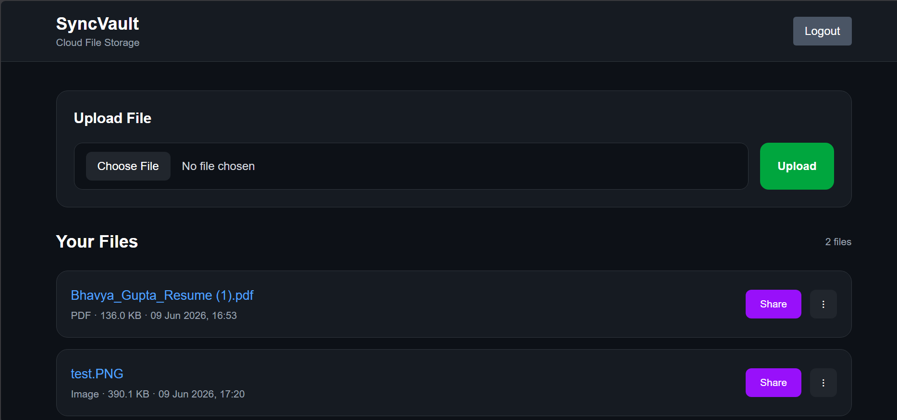

# SyncVault

A full-stack cloud file storage and sharing platform — built with React, Node.js, PostgreSQL and Backblaze B2 object storage.

🔗 **Live Demo: [syncvault-storage.vercel.app](https://syncvault-storage.vercel.app)**

---



---

## What is SyncVault?

SyncVault lets users securely upload, manage, preview and share files from the browser without ever downloading them first. Files are stored in Backblaze B2 object storage (S3-compatible), with metadata persisted in PostgreSQL. Share links support expiry, one-time use and revocation giving owners full control over who can access their files and for how long.

---

## Features

**File Management**

- Upload files securely with multipart form handling via Multer
- Stream files directly from B2 storage no intermediate server buffering
- Preview images, PDFs, and videos in-browser without downloading
- Delete files with storage cleanup MinIO object is removed before the DB record to prevent orphaned objects
- Each file is owned by the uploading user; no cross-user access without an explicit share link

**Share Links**

- Generate up to 15 share links per file
- Expiring links set a TTL, link auto-invalidates after expiry
- One-time-use links invalidated immediately after first access
- Revocable links owner can manually invalidate any active link
- Share quota per file prevents link spam

**Auth & Security**

- JWT-based authentication with protected frontend routes and backend middleware
- Passwords hashed with bcrypt
- All file operations validated against the authenticated user's ownership

---

## Architecture

```
Browser (React · Vercel)
         │
         │  JWT in Authorization header
         ▼
  Express API (Railway)
         │
    ┌────┴────────────────┐
    ▼                     ▼
NeonDB (PostgreSQL)   Backblaze B2
  · users             · file objects
  · file metadata     · accessed via
  · share links         presigned URLs
  · ownership
```

**Request flow for file access:**

1. Client sends JWT to Express API
2. API validates ownership or share link permission
3. API generates a presigned B2 URL (time-limited, direct-to-storage)
4. Client fetches file directly from B2 — API is not in the data path

This means the backend never buffers file bytes during downloads, keeping API latency low regardless of file size.

---

## Engineering Decisions

**Why Backblaze B2 over AWS S3?**
B2 has zero egress fees and a generous free tier. More importantly, B2 exposes an S3-compatible API — the entire storage layer uses the MinIO SDK, so swapping to S3, GCS or any other provider requires changing three environment variables and zero lines of code.

**Why delete the B2 object before the PostgreSQL record?**
If the DB delete runs first and then the B2 delete fails, the file object becomes an orphan with no metadata reference, no way to find or clean it up, permanent storage leak. Deleting from B2 first means a failure leaves a recoverable DB row pointing to a valid object. Retrying is safe.

**Why presigned URLs instead of proxying downloads through the backend?**
Proxying would route every downloaded byte through the Express server, making it the bottleneck for large files. Presigned URLs let clients pull directly from B2, keeping the API layer stateless and horizontally scalable.

**Why PostgreSQL for metadata instead of MongoDB?**
Share links, file ownership, and expiry logic all involve relational constraints and transactional updates. PostgreSQL's foreign keys and `ON DELETE CASCADE` enforce data integrity at the schema level rather than in application code.

---

## Tech Stack

| Layer            | Technology                                        |
| ---------------- | ------------------------------------------------- |
| Frontend         | React.js, Vite, Tailwind CSS, React Router, Axios |
| Backend          | Node.js, Express.js, Multer, JWT, bcrypt          |
| Database         | PostgreSQL (hosted on Neon)                       |
| Object Storage   | Backblaze B2 via MinIO SDK (S3-compatible)        |
| Frontend Hosting | Vercel                                            |
| Backend Hosting  | Railway                                           |

---

## Local Setup

### Prerequisites

- Node.js 18+
- PostgreSQL (local instance or free Neon account)
- MinIO or a Backblaze B2 / any S3-compatible bucket

### 1. Clone the repo

```bash
git clone https://github.com/bhvyx/SyncVault.git
cd SyncVault
```

### 2. Backend

```bash
cd backend
npm install
npm run dev
```

### 3. Frontend

```bash
cd frontend
npm install
npm run dev
```

### Environment Variables

**backend `.env`**

```env
DATABASE_URL=

JWT_SECRET=

B2_ENDPOINT=          # e.g. s3.us-west-004.backblazeb2.com (or localhost:9000 for local MinIO)
B2_BUCKET_NAME=
B2_ACCESS_KEY_ID=
B2_SECRET_ACCESS_KEY=
B2_USE_SSL=           # true for B2, false for local MinIO

FRONTEND_URL=
PORT=
```

**frontend `.env`**

```env
VITE_API_URL=         # e.g. http://localhost:3000
```

---

## Author

**Bhavya Gupta**
[GitHub](https://github.com/bhvyx) · [LinkedIn](https://linkedin.com/in/bhavya2302)
